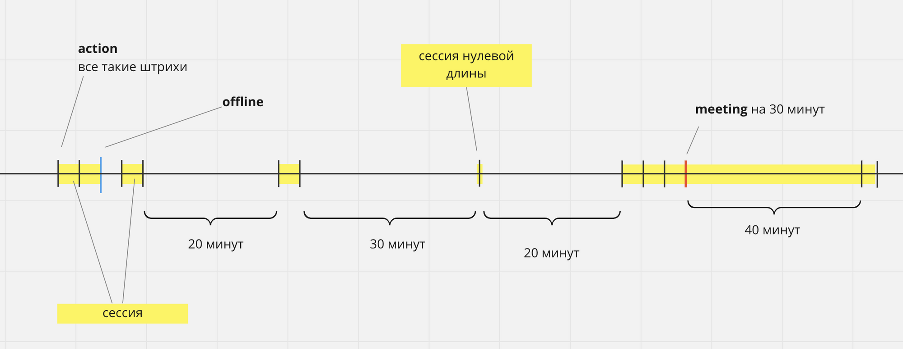

# DDL/Тестовое задание для Аналитика

# 1)**Задача на Python:**

`Результат: task_1.ipynb`

Есть данные по переходам на страницы из трекинга одного из сервисов за определённое время. В это время сервис проводил тест новой страницы регистрации. Можно ли сказать, что новая страница регистрации лучше старой? 
Определите, какие метрики можно использовать для определения "хорошести" страницы и посчитайте их. 

К ответу на ТЗ должен быть приложен полный код расчётов в .py или .ipynb файлах. (Оцениваться будет и аналитическая составляющая и код)

**Ссылка: [https://drive.google.com/drive/folders/1lCqwpHc2fu9mlu2IFdIq270Nt3me7bVE?usp=sharing](https://drive.google.com/drive/folders/1lCqwpHc2fu9mlu2IFdIq270Nt3me7bVE?usp=sharing)** 

# 2)**Построение сессий на SQL**

`Результат: task_2.sql`

Для анализа пользовательского поведения нужна сущность “сессия”. Задача — собрать табличку, каждая строка которой будет являться отдельной сессией. Под сессией мы понимаем непрерывную активность пользователя, внутри которой нет большого перерыва. Или этот перерыв регламентирован (см. ниже событие **meeting**)

Исходно у нас есть таблица с событиями следующих типов

- **action**. Любое активное действие пользователя.
- **meeting** с указанием длительности. Считаем, что пользователь все указанное время находится на звонке и там не требуется активность
- **offline.** Событие, которое говорит о выходе из системы. После него сессия всегда закрывается что бы ни происходило

Логика сборки сессий следующая:

- сессия всегда начинается событиями *action* или *meeting*
- сессия продолжается, если после *action* или конца *meeting* в течение 15 минут есть действия (*action* или *meeting)*
- сессия заканчивается событиями *action, offline,* или через event_props ~~минут~~`секунд` после события *meeting*
- сессия может быть нулевой длины
- событие offline всегда закрывает сессию, что бы ни происходило

Ниже иллюстрация:

Поля таблицы событий events:

- dt — *datetime*
- user_id — *string*
- event_type — *string*
- event_props — *int* для простоты. Заполнено только для event_type=’meeting’. Хранится длительность встречи в секундах)

Надо написать запрос на SQL любого диалекта, который выдаст таблицу сессий sessions с полями

- user_id — *string*
- dt_start — *datetime*
- dt_end — *datetime?* (NULL если сессия активна на момент расчета)

**Решение:** 
Результаты тестового задания лучше всего загрузить в облако или отправить ответ ссылку на Github в Telegram [https://t.me/seaofelisa](https://t.me/seaofelisa) или на @почту - e.danilson@ddl.com